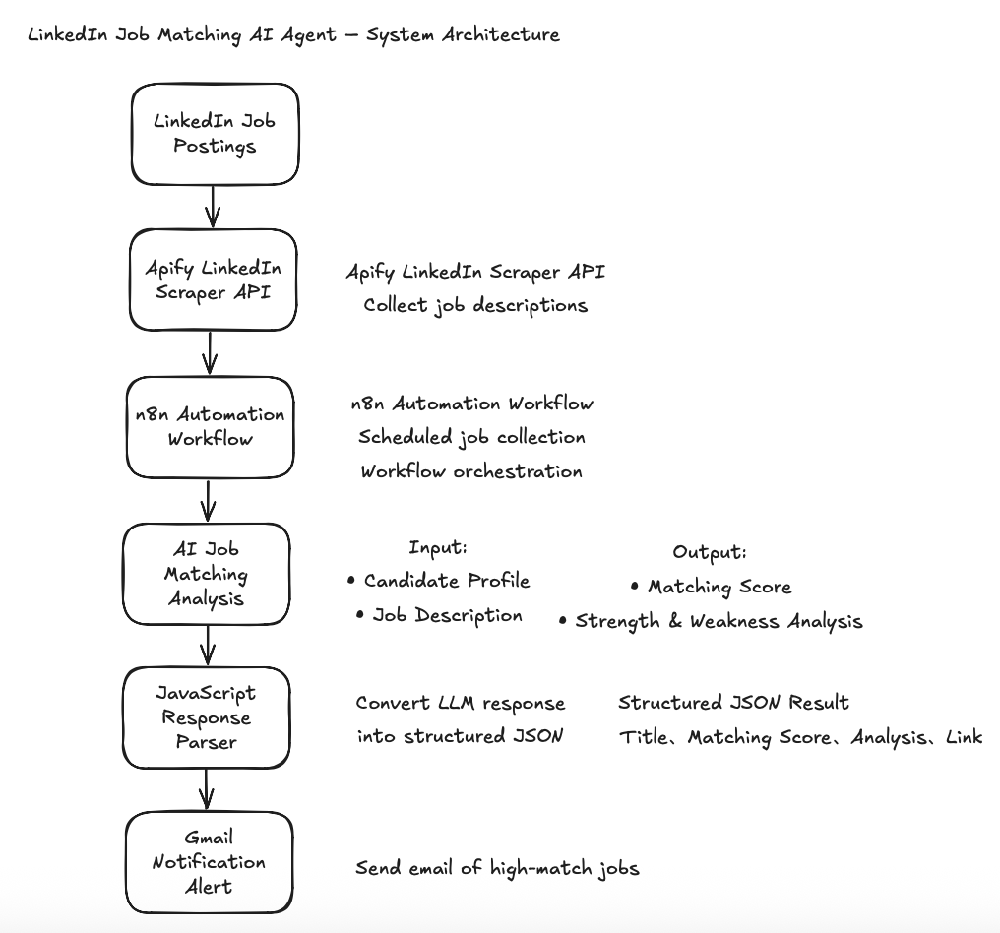
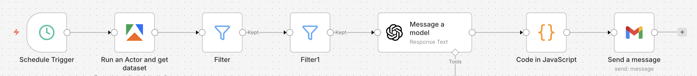
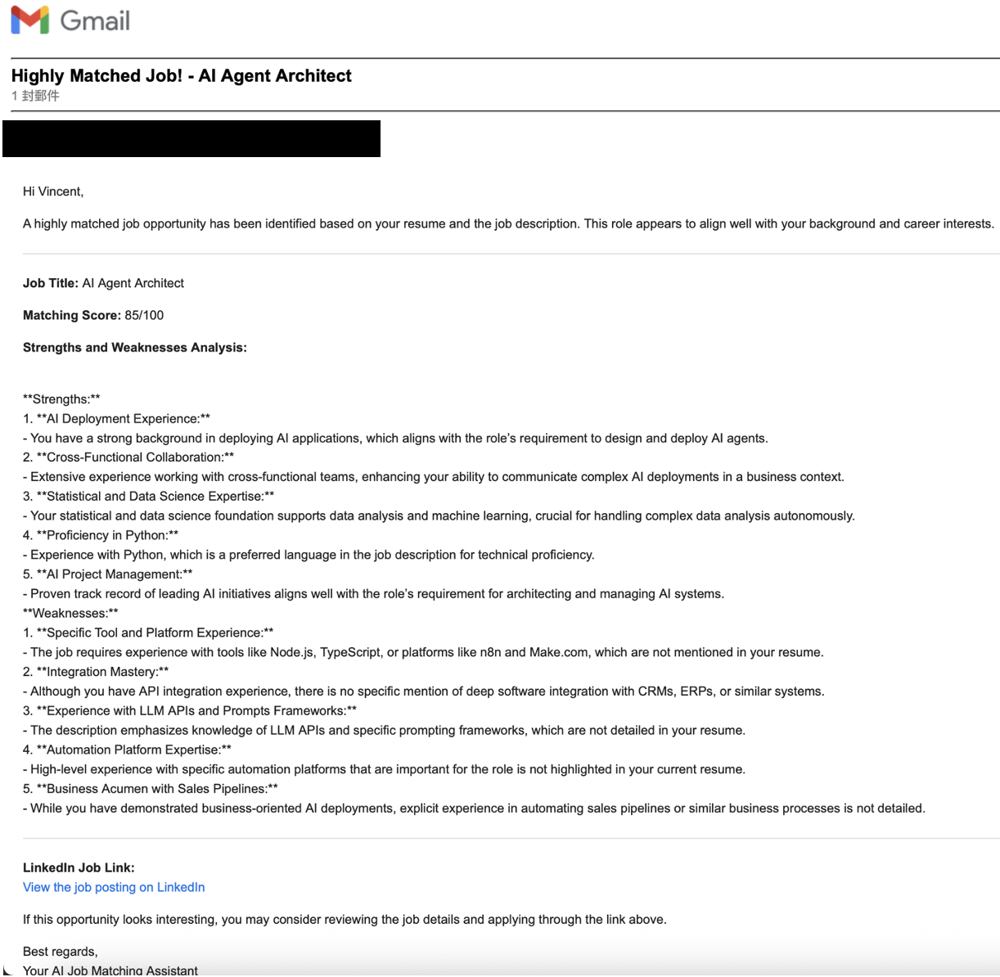

# LinkedIn Job Matching AI Agent

An AI-powered automation system that continuously monitors LinkedIn job postings and evaluates how well they match my background.

The system runs on a daily schedule to filter out highly relevant job opportunities and notify me of the best matches.

---

## Overview

## Motivation

While preparing for my next career step in the Netherlands, I realized that manually browsing LinkedIn for relevant job opportunities can be very time-consuming.

To solve this problem, I built an automation system that collects job postings, analyzes their relevance using AI, and sends notifications with top matched jobs.

---

## System Architecture

---

## Workflow Overview

---

## Example Email Notification

Below is an example of the email alert sent when a highly relevant job opportunity is detected.

---

## Workflow Logic

LinkedIn Jobs
↓
Apify API
↓
n8n Automation Workflow
↓
AI Job Matching Analysis
↓
JSON Parsing
↓
Gmail Notification

---

## Tech Stack

- n8n
- Apify API
- JavaScript
- AI API
- Gmail API
- HTML
- VPS / Docker

---

## Project Structure

linkedin-job-matching-ai-agent
├── prompts
├── scripts
├── email
├── workflow
└── docs

---

## Future Improvements

- Support more job platforms
- Improve matching algorithm
- Store matched jobs in a database
